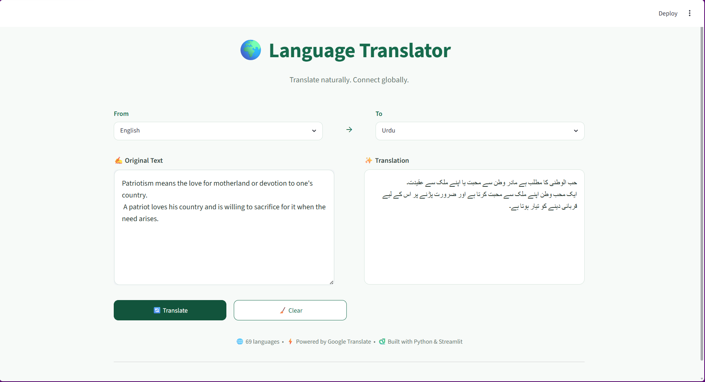

# 🌍 Language Translator

> A simple multilingual text translation web application built with Python and Streamlit.

[🚀 Live Demo](https://mairakhan-ai-language-translator-app-ewpnrt.streamlit.app/) · [💻 GitHub Repository](https://github.com/MairaKhan-AI/Language-Translator)

---

## 📸 Application Preview



---

## 📌 About the Project

**Language Translator** is a user-friendly multilingual text translation web application built with **Python** and **Streamlit**.

The application uses the **deep-translator** library to translate text between multiple languages through Google Translate.

The interface is designed to provide a clean and simple translation experience, including support for **right-to-left languages** such as Urdu, Arabic, Persian, and Pashto.

---

## ✨ Features

- 🌐 Translate text between **70 languages**
- 🎯 Select source and target languages using dropdown menus
- 🔄 Clear input and translation with one click
- ⚠️ Input validation
  - Prevents empty text submission
  - Prevents selecting the same source and target language
- ⏳ Loading spinner while translating
- ✅ Success and error handling
- ↔️ Right-to-left text support for RTL languages
- 🖥️ Clean and responsive Streamlit interface
- 📱 Fixed translation panel for a smoother user experience

---

## 🛠️ Technologies Used

- **Python**
- **Streamlit**
- **deep-translator**
- **Git**
- **GitHub**

---

## 🌍 Supported Languages

The application supports **70 languages**, including:

- Afrikaans
- Albanian
- Arabic
- Armenian
- Azerbaijani
- Bengali
- Bosnian
- Bulgarian
- Catalan
- Chinese (Simplified)
- Chinese (Traditional)
- Croatian
- Czech
- Danish
- Dutch
- English
- Estonian
- Filipino
- Finnish
- French
- German
- Greek
- Gujarati
- Hausa
- Hebrew
- Hindi
- Hungarian
- Icelandic
- Indonesian
- Italian
- Japanese
- Kannada
- Kazakh
- Korean
- Latvian
- Lithuanian
- Macedonian
- Malay
- Malayalam
- Marathi
- Mongolian
- Nepali
- Norwegian
- Pashto
- Persian
- Polish
- Portuguese
- Punjabi
- Romanian
- Russian
- Serbian
- Sinhala
- Slovak
- Slovenian
- Spanish
- Swahili
- Swedish
- Tamil
- Telugu
- Thai
- Turkish
- Ukrainian
- Urdu
- Uzbek
- Vietnamese
- Welsh
- Yoruba
- Zulu

---

## ⚙️ How It Works

1. Enter the text you want to translate.
2. Select the source language.
3. Select the target language.
4. Click **Translate**.
5. The application processes the request using the `deep-translator` library.
6. The translated text appears in the translation panel.
7. RTL languages are automatically displayed in the correct writing direction.

---

## 📂 Project Structure

```text
Language-Translator/
│
├── app.py
├── translator.py
├── requirements.txt
├── README.md
└── LT_screenshots/
    └── app.png
```

---

## 🚀 Installation

### 1. Clone the repository

```bash
git clone https://github.com/MairaKhan-AI/Language-Translator.git
```

### 2. Move into the project folder

```bash
cd Language-Translator
```

### 3. Install the required dependencies

```bash
pip install -r requirements.txt
```

### 4. Run the application

```bash
streamlit run app.py
```

The application will open in your browser.

---

## 🎯 Learning Outcomes

During this project, I learned:

Building interactive web applications with Streamlit
Using translation services through the deep-translator library
Designing user-friendly interfaces with custom CSS
Supporting right-to-left languages
Validating user input
Handling exceptions in Python
Organizing Python projects
Managing project dependencies using requirements.txt
Using Git and GitHub for version control
Deploying a Streamlit application to the web

---

## 🔮 Future Improvements

Possible future improvements include:

📋 Copy-to-clipboard functionality
💡 Example translation prompts
🔊 Text-to-speech support
🕘 Translation history
🌙 Dark mode
📄 Document translation

---

## 👩‍💻 Developed By

**Maira Khan**
BS Artificial Intelligence Student

---
⭐ If you find this project useful, feel free to explore the repository or try the live demo.


⭐ If you find this project useful, feel free to explore the repository or try the live demo.
